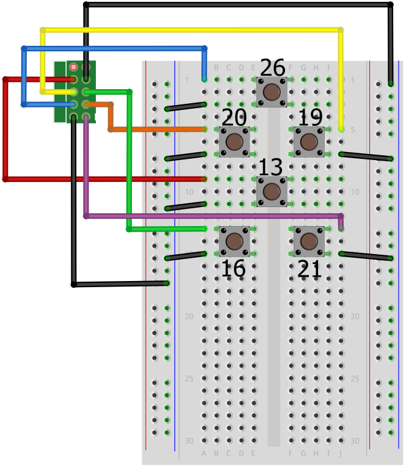

# Flight buttons

The Astro Pi flight case has six general-purpose buttons that you can also use in your programming. These are simply push buttons wired directly to GPIO pins in a pull up circuit: you can easily recreate this setup using a breadboard, some buttons, and some wires.


## Required items

In order to do this you will need access to the following items:

- A breadboard
- 6 tactile push buttons
- 14 male to female jumper cables
- A 40 pin GPIO stacking header (with the long pins)

    Use this to mount the Sense HAT onto the Raspberry Pi instead of the one you received with the HAT. Then you'll have the GPIO pins protruding through the HAT such that jumper cables can be attached to the breadboard.

    Try [Toby Electronics](http://www.toby.co.uk/content/catalogue/products.aspx?series=REF-18xxxx-0x), part number REF-182684-02

## GPIO mapping

The buttons are wired to the last six pins at the bottom of the GPIO header pins on the Pi.


Note the orientation of the pin diagram is with the Ethernet and USB ports facing downwards, and the row of pins on the right hand side of the Pi.

This means that this setup cannot be exactly replicated if you're using an old model A or B Pi. If you are using an older model you can choose other pins, but be sure to modify the pin numbering in your code so that it will work on a flight unit before you submit via the competition website.

These are the pin assignments:

- Top quad
    - UP: GPIO 26, pin 37
    - DOWN: GPIO 13, pin 33
    - LEFT: GPIO 20, pin 38
    - RIGHT: GPIO 19, pin 35
- Bottom pair
    - A (left): GPIO 16, pin 36
    - B (right): GPIO: 21, pin 40

If you use these buttons in your Astro Pi competition entry, then you will need to comply with these pin assignments in order for your code to work on the flight hardware that Tim Peake will have on the ISS.

## Breadboard wiring

The diagram below shows how to wire up the six buttons on a breadboard so that they match the flight hardware. As always, wire colour does not matter. The numbers next to each button indicate the GPIO number that they are connected to. Every button requires one side to be connected to ground so that the `HIGH` GPIO pin can be shorted to `LOW` when the button is pressed.




## Detect a button press in code

You might be expecting to use the `RPi.GPIO` or `gpiozero` libraries to detect the button presses. You *could* do it this way but this makes it difficult when you want your code to handle [joystick](joystick.md) *and* button events at the same time. To make it easier there is a device tree overlay that causes the buttons to type `u`, `d`, `l`, `r`, `a` and `b` when you press them.

This is how the Astro Pis on the ISS work and it's the way we recommend your code is written if you're participating in a competition.

Once you have all the buttons wired up, start up your Raspberry Pi with a monitor, keyboard and mouse connected. We need to download some files and change a few configuration settings. Firstly, download the device tree overlay that maps the push buttons to corresponding keyboard keys. Open a terminal and enter these commands:

```bash
cd /boot/overlays
sudo wget https://github.com/raspberrypilearning/astro-pi-guide/raw/master/inputs-outputs/dtb/astropi-keys.dtb --no-check-certificate
ls
```

Check that the file `astropi-keys.dtb` is now showing in the list of files.

Next, we need to configure `config.txt` to load this overlay:

```bash
sudo nano /boot/config.txt
```

Go to the bottom of the file and enter the line below:

```bash
dtoverlay=astropi-keys
```

Press `Ctrl - O` then `Enter` to save, followed by `Ctrl - X` to quit.

Now reboot the Astro Pi.

```bash
sudo reboot
```

Now let's download and run a Python test program to check everything is working. The test code uses [Pygame](http://pygame.org/wiki/tutorials), so please do this on the Raspberry Pi's own screen and not via remote access. Open a terminal and enter these commands:

```bash
cd ~
wget https://github.com/raspberrypilearning/astro-pi-guide/raw/master/inputs-outputs/test_code/pygame_test.py --no-check-certificate
chmod +x pygame_test.py
./pygame_test.py
```

Waggle the joystick and press all the push buttons. If everything is working, the joystick should give a direction indication and the buttons will show the corresponding letter on the LED matrix. Press `Escape` to exit.

The flight unit uses hardware pull ups on the GPIO pins; however, this test code enables the Raspberry Pi's own internal pull up resistors so your button wiring can be nice and simple. Because of this, you will also need to set the internal pull ups in any Astro Pi code that you write. The block of code below will do this for you; just make sure you have this at the top of each program you write.

```python
import RPi.GPIO as GPIO

UP = 26
DOWN = 13
LEFT = 20
RIGHT = 19
A = 16
B = 21

GPIO.setmode(GPIO.BCM)

for pin in [UP, DOWN, LEFT, RIGHT, A, B]:
    GPIO.setup(pin, GPIO.IN, GPIO.PUD_UP)
```
