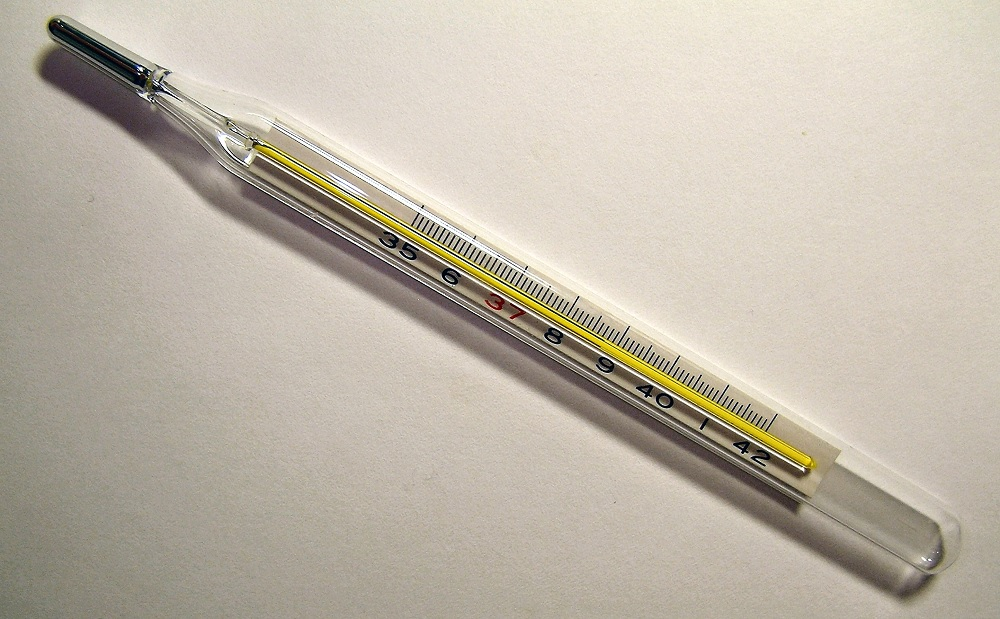

# Temperature

In this lesson you will:

- Use the `sudo` command
- Take temperature measurements in code
- Round numbers in code
- Display temperature intuitively on the LED matrix

## A thermometer

1. Who has had one of these stuck in their mouth before?

  

1. This is a clinical thermometer. Notice that the numbers start at 35, so it's only used for measuring human body temperature.
1. The Astro Pi temperature sensors can measure temperatures from as low as -40 up to +120 degrees Celsius though, so they are much more versatile than a clinical thermometer.
1. The Astro Pi has *two* temperature sensors. One is built into the humidity sensor and the other is built into the pressure sensor. You can choose which one to use or you could use *both* and average the result.

## Programming

1. Boot up your Astro Pi computer.

  Log in using the following login information:

  ```bash
  Login: pi
  password: raspberry
  ```

  You will not see any text when typing the password, this is a security feature. Just type it blind.
1. Load the graphical user interface by typing `startx`.
1. Open a terminal window using `Menu > Accessories > Terminal`.
1. Type in the following command:

  ```bash
  sudo idle3 &
  ```

1. A Python Shell window will now appear. The terminal window can now be closed.
1. Select `File > New Window`.
1. Enter the following code:

  ```python
  from astro_pi import AstroPi
  
  ap = AstroPi()
  ap.clear()
  
  temp = ap.get_temperature()
  print(temp)
  ```

1. Select `File > Save` and choose a file name for your program.
1. Select `Run > Run module`.
1. If you see the error `Humidity Init Failed, please run as root / use sudo` (look on the last line of the message in red) it means you haven't followed the instructions above. Close everything and go back to step 3.
1. You should see something like this:

  ```bash
  Humidity sensor Init Succeeded
  28.6293258667
  ```

1. Just before the `print(temp)` line add this line below:

  ```python
  temp = round(temp, 1)
  ```

1. You should now see something like this (without all the numbers after the decimal point):

  ```bash
  Humidity sensor Init Succeeded
  28.6
  ```

1. Try the following functions instead of `get_temperature`.

  - `get_temperature_from_humidity` (uses the humidity sensor, `get_temperature` is a short version of this)
  - `get_temperature_from_pressure` (uses the pressure sensor)

  For example:

  ```python
  from astro_pi import AstroPi
  
  ap = AstroPi()
  ap.clear()
  
  temp = ap.get_temperature_from_pressure()
  temp = round(temp, 1)
  print(temp)
  ```

1. It would be good to monitor the temperature as it changes, so let's put our code into a `while` loop and run it again.

  ```python
  while True:
      temp = ap.get_temperature()
      temp = round(temp, 1)
      print(temp)
  ```

1. Put your thumb over the sensor and hold it there. The measurement should start to rise.
1. Blow on it (or give the sensors a short blast from an air duster, if available). The measurement should fall.
1. Press `Ctrl - C` to stop the program.
1. The next task would be to show this information on the LED matrix in some way. Think about how you would do this and listen to your teacher explain the options.
